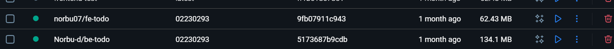
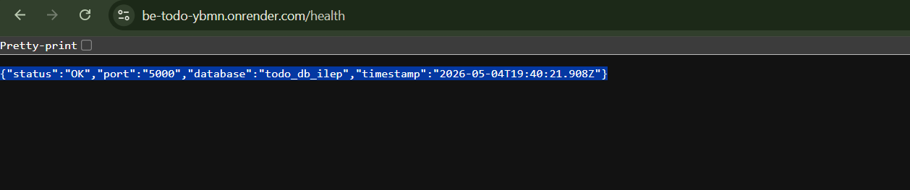
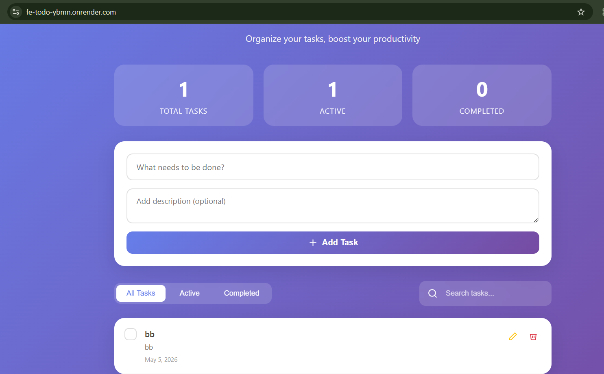
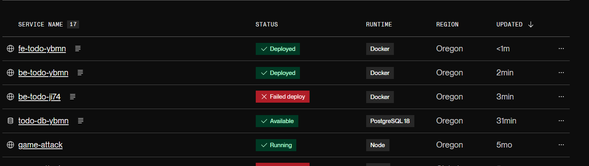

# DSO101 Assignment 1 - CI/CD Pipeline
## Continuous Integration and Continuous Deployment
**Bachelor's of Engineering in Software Engineering (SWE)**  
**Student:** Norbu  Dhendup
**Course:** DSO101 - Continuous Integration and Continuous Deployment  

---

## Table of Contents
- [Overview](#overview)
- [Application Architecture](#application-architecture)
- [Step 0: Web Application Setup](#step-0-web-application-setup)
- [Part A: Deploying Docker Images to Docker Hub & Render](#part-a-deploying-docker-images-to-docker-hub--render)
- [Part B: Automated Image Build and Deployment](#part-b-automated-image-build-and-deployment)
- [Live URLs](#live-urls)
- [Key Learnings](#key-learnings)

---

## Overview

This assignment demonstrates building and deploying a full-stack To-Do List web application using Docker, Docker Hub, and Render.com. The application consists of three components:

- **Frontend:** React + Vite application with a task management UI
- **Backend:** Node.js + Express REST API
- **Database:** PostgreSQL for persistent task storage

---

## Application Architecture

```
┌─────────────────┐        ┌─────────────────┐        ┌─────────────────┐
│                 │        │                 │        │                 │
│   Frontend      │──────▶ │    Backend      │──────▶ │   PostgreSQL    │
│  React + Vite   │        │  Node + Express │        │    Database     │
│  Port: 80       │        │  Port: 5000     │        │  Port: 5432     │
│                 │        │                 │        │                 │
└─────────────────┘        └─────────────────┘        └─────────────────┘
```

---

## Step 0: Web Application Setup

### Project Structure

```
DSO101/
├── backend/
│   ├── server.js
│   ├── package.json
│   ├── Dockerfile
│   └── .env
├── frontend/
│   ├── src/
│   │   └── App.jsx
│   ├── Dockerfile
│   ├── nginx.conf
│   └── .env
├── docker-compose.yml
├── render.yaml
└── README.md
```

### Environment Variables

**Backend `.env`:**
```
DB_HOST=localhost
DB_USER=postgres
DB_PASSWORD=postgres
DB_NAME=todo_db
DB_PORT=5432
PORT=5000
```

**Frontend `.env`:**
```
VITE_API_URL=http://localhost:5000
```

> ⚠️ `.env` files are added to `.gitignore` and never committed to Git.

### Running Locally with Docker Compose

```bash
docker-compose up --build
```

The app runs at:
- Frontend: http://localhost:80
- Backend: http://localhost:5000
- Health check: http://localhost:5000/health

---

## Part A: Deploying Docker Images to Docker Hub & Render

### Step 1: Building and Pushing Docker Images

**Backend image build and push:**
```bash
docker build -t norbu/be-todo:02230293 ./backend
docker push norbu/be-todo:02230293
```

**Frontend image build and push:**
```bash
docker build -t norbu/fe-todo:02230293 ./frontend
docker push norbu/fe-todo:02230293
```

> The student ID `02230293` is used as the image tag as required.

### Screenshot: Docker Hub - Backend Image


### Step 2: Deploying Backend on Render.com

1. Go to [render.com](https://render.com) → **New Web Service**
2. Select **"Existing image from Docker Hub"**
3. Enter image: `norbu/be-todo:02230293`
4. Set the following environment variables:

| Key | Value |
|-----|-------|
| DB_HOST | dpg-d7sf3a8sfn5c73ffeel0-a |
| DB_NAME | todo_db_ilep |
| DB_USER | todo_user |
| DB_PASSWORD | *(hidden)* |
| DB_PORT | 5432 |
| PORT | 5000 |

### Step 3: Setting Up PostgreSQL Database on Render

1. Go to Render → **New PostgreSQL**
2. Name: `todo-db`
3. Copy the **Internal Database URL** and use its components as environment variables in the backend service

### Screenshot: Render Backend Service Deployed


### Step 4: Deploying Frontend on Render.com

1. Go to Render → **New Web Service**
2. Select **"Existing image from Docker Hub"**
3. Enter image: `norbu/fe-todo:02230293`
4. Set environment variable:

| Key | Value |
|-----|-------|
| VITE_API_URL | https://be-todo-ybmn.onrender.com |

### Screenshot: Frontend Deployed on Render


### Step 5: Verifying the Deployment

Backend health check confirms successful deployment and database connection:

```json
{
  "status": "OK",
  "port": "5000",
  "database": "todo_db_ilep",
  "timestamp": "2026-05-04T19:40:21.908Z"
}
```

### Screenshot: Deployment Overview


---

## Part B: Automated Image Build and Deployment

### How It Works

Every time a new commit is pushed to the `main` branch on GitHub, Render automatically:
1. Detects the new commit
2. Rebuilds the Docker image
3. Redeploys the service with the new image

### render.yaml (Blueprint Configuration)

```yaml
services:
  - type: web
    name: be-todo
    env: docker
    dockerfilePath: ./backend/Dockerfile
    envVars:
      - key: DB_HOST
        value: dpg-d7sf3a8sfn5c73ffeel0-a
      - key: DB_NAME
        value: todo_db_ilep
      - key: DB_USER
        value: todo_user
      - key: DB_PASSWORD
        value: your_db_password
      - key: PORT
        value: 5000

  - type: web
    name: fe-todo
    env: docker
    dockerfilePath: ./frontend/Dockerfile
    envVars:
      - key: VITE_API_URL
        value: https://be-todo-ybmn.onrender.com

databases:
  - name: todo-db
    databaseName: todo_db
    user: todo_user
```

### Key Configuration: Passing Vite Build Args in Dockerfile

Since Vite bakes environment variables at **build time**, the frontend Dockerfile uses `ARG` to pass the API URL:

```dockerfile
ARG VITE_API_URL
ENV VITE_API_URL=$VITE_API_URL
RUN npm run build
```

This ensures the correct backend URL is embedded in the production build.

### Automated Deployment Overview

The following diagram shows the complete CI/CD pipeline with automatic image builds and deployments triggered by GitHub commits:


---

## Live URLs

| Service | URL |
|---------|-----|
| Frontend | https://fe-todo-ybmn.onrender.com |
| Backend API | https://be-todo-ybmn.onrender.com/api/tasks |
| Health Check | https://be-todo-ybmn.onrender.com/health |

---

## Key Learnings

- Docker images must be built with the correct environment variables baked in for Vite (build-time variables)
- Render PostgreSQL requires SSL (`rejectUnauthorized: false`) for database connections
- The `render.yaml` blueprint file allows multi-service orchestration similar to `docker-compose.yml`
- Never commit `.env` files — use platform environment variable settings instead