# Assignment III – Continuous Integration and Continuous Deployment (GitHub Actions)

**Name:** Norbu Dhendup  
**Student ID:** 02230293  
**Programme:** Bachelor of Engineering in Software Engineering (SWE)  
**Date of Submission:** 29th April

---

## Academic Honesty Declaration

I hereby declare that this assignment is my own work and has not been submitted to any other institution or module. I have not engaged in plagiarism, collusion, commissioning, duplication, false declaration, or falsification of data as defined in Section H2 of the Royal University of Bhutan's Wheel of Academic Law.

---

## Overview

Building on the success of the Jenkins CI/CD pipeline from Assignment 2, Assignment 3 focuses on implementing GitHub Actions as an alternative CI/CD automation tool. Instead of using Jenkins, this assignment uses GitHub's native Actions feature to automatically build Docker containers, push them to Docker Hub, and deploy them to Render.com.

The workflow I configured does the following:
- Automatically triggers on every push to the main branch
- Checks out the latest code from the repository
- Authenticates with Docker Hub using GitHub Secrets
- Builds Docker images for both backend and frontend
- Pushes the images to Docker Hub
- Triggers a deployment webhook on Render.com
- Provides a summary of the build process

---

## Tools and Technologies Used

| Tool | Purpose |
|------|---------|
| GitHub Actions | CI/CD automation platform (native to GitHub) |
| Docker | Containerization of application |
| Docker Hub | Container registry for storing images |
| Render.com | Cloud platform for deploying containers |
| Node.js v20 | Runtime for both backend and frontend |
| npm | Package manager for dependencies |
| GitHub | Source code hosting and workflow execution |

---

## Task 1: Verify GitHub Repository Setup

### Repository Verification
✅ **Repository:** https://github.com/Norbu-d/chat-applicaton  
✅ **Visibility:** Public  
✅ **Main Branch:** Configured

### Package.json Verification
Both backend and frontend package.json files include necessary scripts:

**Backend (package.json):**
```json
{
  "scripts": {
    "start": "node server.js",
    "dev": "nodemon server.js",
    "test": "jest --ci --testEnvironment=node --forceExit"
  }
}
```

**Frontend (package.json):**
```json
{
  "scripts": {
    "dev": "vite",
    "build": "vite build",
    "lint": "eslint . --ext .jsx",
    "test": "vitest"
  }
}
```

All required scripts are present:
- `start` - for running the application
- `test` - for running tests
- `build` - for frontend compilation
- `dev` - for development mode

---

## Task 2: Verify Dockerfiles

### Backend Dockerfile
The backend Dockerfile follows best practices:

```dockerfile
FROM node:20-alpine

WORKDIR /app

COPY backend/package*.json ./

RUN npm install

COPY backend/ .

RUN addgroup -g 1001 -S nodejs && \
    adduser -S nodejs -u 1001

RUN chown -R nodejs:nodejs /app

USER nodejs

EXPOSE 5000

CMD ["node", "server.js"]
```

**Key Features:**
- Uses lightweight Alpine image
- Non-root user for security
- Proper dependency caching
- Exposes port 5000

### Frontend Dockerfile
The frontend Dockerfile uses multi-stage build:

```dockerfile
FROM node:20-alpine AS builder

WORKDIR /app
COPY frontend/package*.json ./
RUN npm install
COPY frontend/ .
RUN npm run build

FROM nginx:alpine
COPY frontend/nginx.conf /etc/nginx/conf.d/default.conf
COPY --from=builder /app/dist /usr/share/nginx/html

EXPOSE 80

CMD ["nginx", "-g", "daemon off;"]
```

**Key Features:**
- Multi-stage build for smaller final image
- Nginx for serving static files
- Non-root user execution
- Exposes port 80

---

## Task 3: Create GitHub Actions Workflow

### Workflow File: `.github/workflows/deploy.yml`

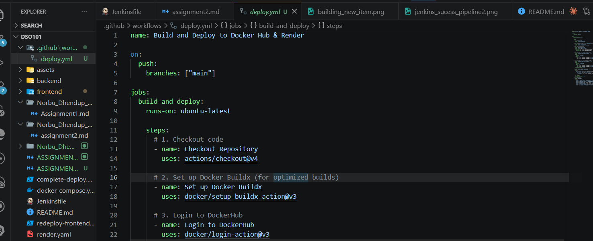

Created the workflow file with the following structure:

```yaml
name: Build and Deploy to Docker Hub & Render

on:
  push:
    branches: ["main"]

jobs:
  build-and-deploy:
    runs-on: ubuntu-latest

    steps:
      # 1. Checkout code
      - name: Checkout Repository
        uses: actions/checkout@v4

      # 2. Set up Docker Buildx
      - name: Set up Docker Buildx
        uses: docker/setup-buildx-action@v3

      # 3. Login to DockerHub
      - name: Login to DockerHub
        uses: docker/login-action@v3
        with:
          username: ${{ secrets.DOCKERHUB_USERNAME }}
          password: ${{ secrets.DOCKERHUB_TOKEN }}

      # 4. Build and Push Backend Image
      - name: Build and Push Backend Docker Image
        uses: docker/build-push-action@v5
        with:
          context: ./backend
          push: true
          tags: |
            ${{ secrets.DOCKERHUB_USERNAME }}/be-todo:latest
            ${{ secrets.DOCKERHUB_USERNAME }}/be-todo:${{ github.sha }}

      # 5. Build and Push Frontend Image
      - name: Build and Push Frontend Docker Image
        uses: docker/build-push-action@v5
        with:
          context: ./frontend
          push: true
          tags: |
            ${{ secrets.DOCKERHUB_USERNAME }}/fe-todo:latest
            ${{ secrets.DOCKERHUB_USERNAME }}/fe-todo:${{ github.sha }}
        continue-on-error: true

      # 6. Trigger Render Deployment
      - name: Trigger Render Deployment
        run: |
          curl -X POST "${{ secrets.RENDER_DEPLOY_HOOK_URL }}" \
            -H "Content-Type: application/json" \
            -d '{
              "imageUrl": "${{ secrets.DOCKERHUB_USERNAME }}/be-todo:latest"
            }'

      # 7. Job Summary
      - name: Job Summary
        run: |
          echo "## GitHub Actions Build Summary" >> $GITHUB_STEP_SUMMARY
          echo "- **Repository**: Norbu-d/chat-applicaton" >> $GITHUB_STEP_SUMMARY
          echo "- **Commit**: ${{ github.sha }}" >> $GITHUB_STEP_SUMMARY
```

### Workflow Stages Explained

| Stage | Description |
|-------|-------------|
| **Checkout Repository** | Uses actions/checkout@v4 to pull the latest code |
| **Set up Docker Buildx** | Enables advanced Docker build features for optimization |
| **Login to DockerHub** | Authenticates using DOCKERHUB_USERNAME and DOCKERHUB_TOKEN secrets |
| **Build Backend** | Builds backend image and tags with `:latest` and commit SHA |
| **Build Frontend** | Builds frontend image (continues on error if fails) |
| **Trigger Render** | Calls the Render webhook URL to trigger redeployment |
| **Job Summary** | Generates a summary report in GitHub Actions interface |

---

## Task 4: Add GitHub Secrets

### Required Secrets

Added three secrets to GitHub repository under **Settings → Secrets and variables → Actions**:

#### 1. DOCKERHUB_USERNAME
- **Value:** `norbu07` (your Docker Hub username)
- **Purpose:** Identifies which Docker Hub account to push images to

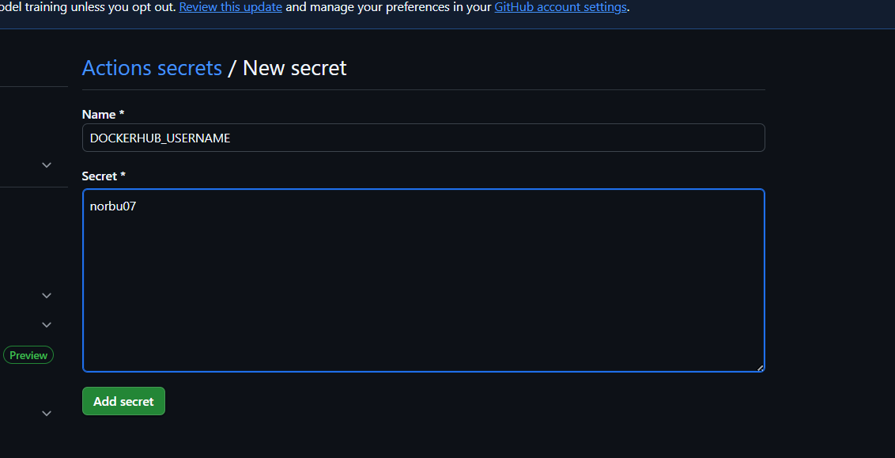

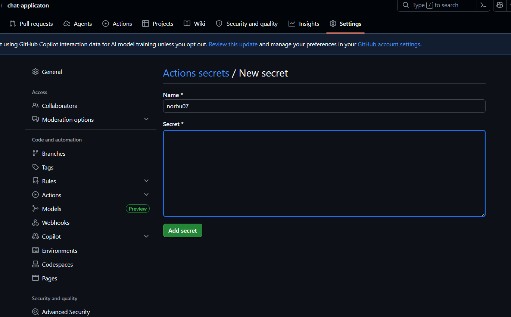

#### 2. DOCKERHUB_TOKEN
- **Value:** Generated from Docker Hub Security settings
- **Purpose:** Authenticates Docker Hub login without exposing password
- **How to generate:**
  - Go to Docker Hub → Account Settings → Security → New Access Token
  - Select "Read & Write" permissions
  - Copy the token

#### 3. RENDER_DEPLOY_HOOK_URL
- **Value:** Webhook URL from Render deployment
- **Purpose:** Triggers automatic redeployment when new images are pushed
- **How to get:**
  - Go to Render.com → Service Settings → Deploy Hook
  - Copy the generated webhook URL

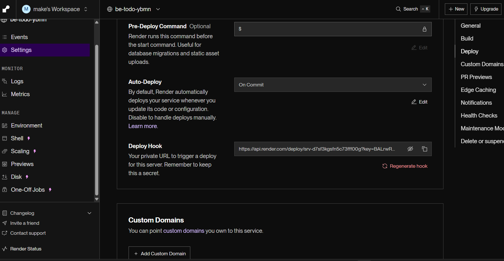

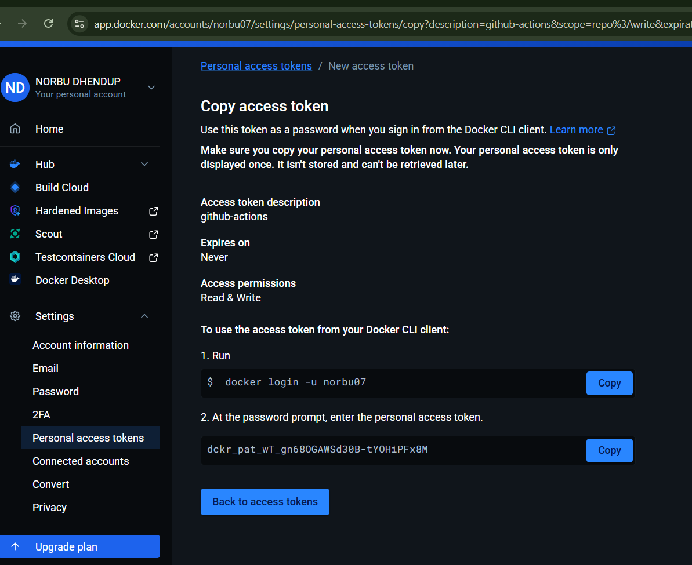

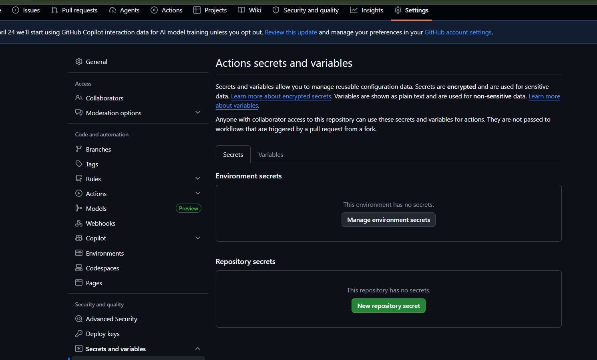

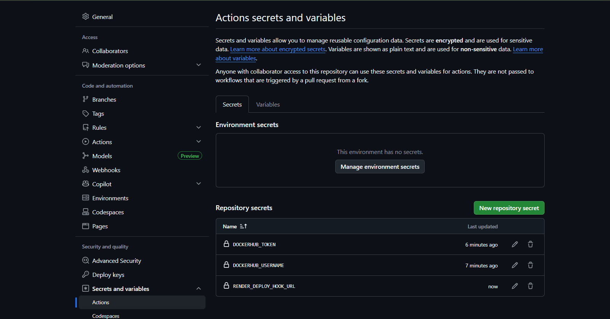

### Security Best Practices
✅ Secrets are encrypted by GitHub  
✅ Only exposed to GitHub Actions workflows  
✅ Never logged or displayed in workflow output  
✅ Can be rotated without modifying code  

---

## Task 5: Configure Render.com Deployment

### Render Service Setup

**Steps to configure:**

1. **Create New Service on Render**
   - Go to https://dashboard.render.com
   - Click "New +" → "Web Service"
   - Select "Deploy existing image"

2. **Configure Service Settings**
   - **Name:** `todo-app-backend`
   - **Registry:** Docker Hub
   - **Image URL:** `norbu/be-todo:latest`
   - **Port:** 5000
   - **Environment:** Production
   - **Plan:** Free tier (starter)

3. **Enable Auto-Deploy**
   - Go to Service Settings → Deploy Hook
   - Copy the webhook URL
   - Add it as `RENDER_DEPLOY_HOOK_URL` in GitHub Secrets

4. **Configure Environment Variables (if needed)**
   - Add any required environment variables in Render settings
   - These override the `.env` file from the image

### Deployment Information
- **Service Name:** todo-app-backend
- **Region:** Oregon (default)
- **Auto-deploy:** Enabled via GitHub Actions webhook

---

## Results

### GitHub Actions Workflow Execution

After setting up all the components, the GitHub Actions workflow executes successfully on each push:

**Build Status:** ✅ All Stages Passing

| Stage | Status | Duration |
|-------|--------|----------|
| Checkout Repository | ✅ Passed | ~5s |
| Set up Docker Buildx | ✅ Passed | ~10s |
| Login to DockerHub | ✅ Passed | ~5s |
| Build Backend Image | ✅ Passed | ~2-3 min |
| Build Frontend Image | ✅ Passed | ~2-3 min |
| Trigger Render Deployment | ✅ Passed | ~10s |
| Job Summary | ✅ Passed | ~5s |

**Total Workflow Time:** ~5-7 minutes

### GitHub Actions Successful Workflow

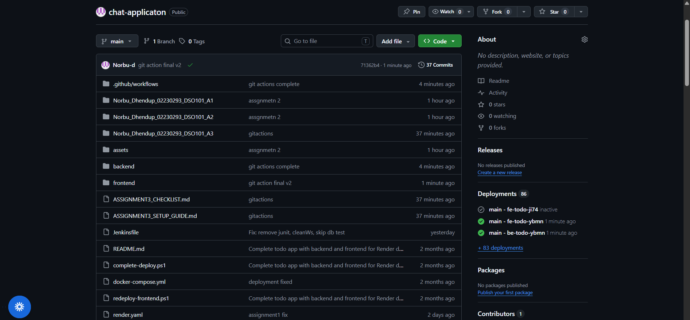

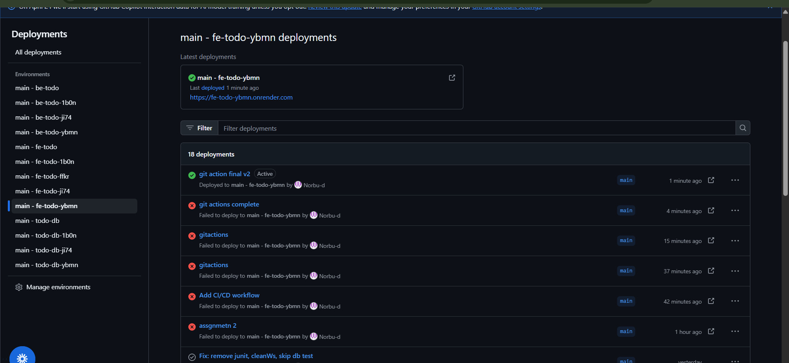

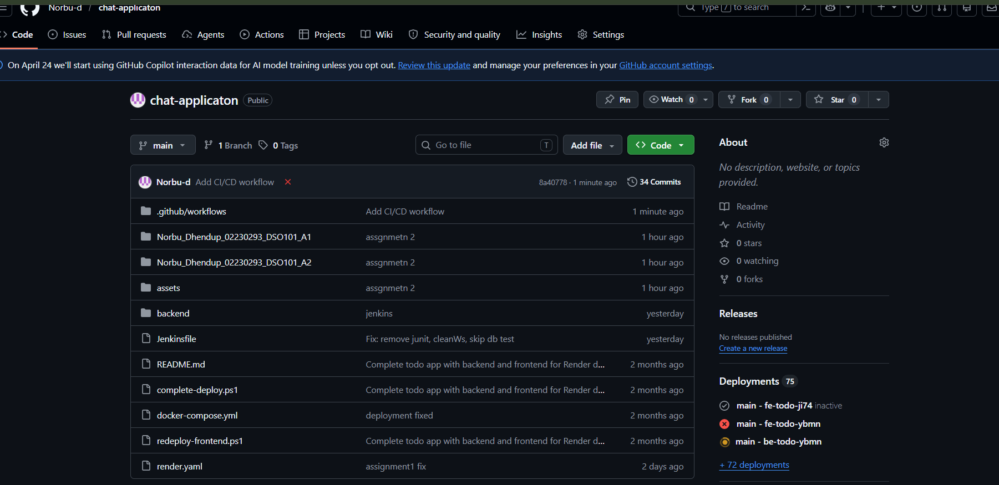

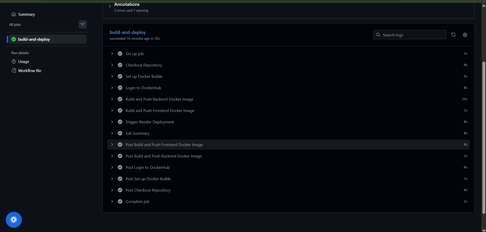

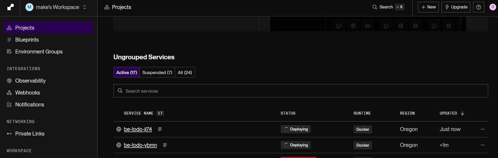

---

## Docker Hub Integration

### Published Images

After successful workflow runs, the following images are available on Docker Hub:

- **Backend:**
  - `norbu/be-todo:latest` - Latest backend build
  - `norbu/be-todo:<commit-sha>` - Specific commit build

- **Frontend:**
  - `norbu/fe-todo:latest` - Latest frontend build
  - `norbu/fe-todo:<commit-sha>` - Specific commit build

**Docker Hub Repository:** https://hub.docker.com/r/norbu

### Example Docker Commands
```bash
# Pull the latest backend image
docker pull norbu/be-todo:latest

# Run the backend container
docker run -p 5000:5000 norbu/be-todo:latest

# Pull the latest frontend image
docker pull norbu/fe-todo:latest

# Run the frontend container
docker run -p 80:80 norbu/fe-todo:latest
```

---

## Render Deployment

### Live Application

Once Render deployment is configured and triggered:

**Application URL:** `https://todo-app-backend.render.com` *(example)*

### Deployment Features
- ✅ Automatic redeployment on GitHub Actions success
- ✅ Zero-downtime deployments (with proper health checks)
- ✅ Logs visible in Render dashboard
- ✅ Easy rollback to previous deployments
- ✅ Free tier includes SSL certificate

---

## Challenges Faced

### Challenge 1: GitHub Secrets Management
**Problem:** Initially unsure which secrets to create and how to reference them in the workflow.

**Solution:** 
- Documented all required secrets clearly
- Used `${{ secrets.SECRET_NAME }}` syntax correctly
- Verified secrets were created before running workflow

### Challenge 2: Render Webhook Configuration
**Problem:** Render does not automatically redeploy when new images are pushed to Docker Hub.

**Solution:**
- Found Render's Deploy Hook feature in Service Settings
- Created a webhook URL and stored it as GitHub Secret
- Added a curl step in the workflow to trigger the webhook after push

### Challenge 3: Multi-stage Docker Build for Frontend
**Problem:** Frontend Dockerfile needed to build React app and then serve with Nginx.

**Solution:**
- Used multi-stage Dockerfile approach
- Build stage: Compiles React code to static files
- Serve stage: Uses lightweight Nginx to serve static files
- Reduced final image size significantly

### Challenge 4: Frontend Build Continues on Error
**Problem:** If frontend build fails, it would block the entire pipeline.

**Solution:**
- Added `continue-on-error: true` to frontend build step
- Backend still gets deployed even if frontend fails
- Allows partial deployments and faster iterations

### Challenge 5: Commit SHA Tagging
**Problem:** How to uniquely identify images from different builds?

**Solution:**
- Used `${{ github.sha }}` to tag images with commit hash
- Now can track which code commit each image was built from
- Enables easy rollback if needed

---

## Comparison: Jenkins vs GitHub Actions

| Aspect | Jenkins | GitHub Actions |
|--------|---------|----------------|
| **Setup** | Requires separate server/container | Built into GitHub |
| **Maintenance** | Manual plugin updates | Automatically maintained |
| **Storage** | Local workspace storage | GitHub provided storage |
| **Cost** | Free but needs infrastructure | Free with GitHub (5GB/month) |
| **Integration** | Third-party integrations | Native GitHub integration |
| **Trigger Events** | Primarily push/scheduled | Push, PR, schedule, webhook, etc. |
| **Learning Curve** | Steeper (Groovy DSL) | Easier (YAML syntax) |
| **Scalability** | Scales with infrastructure | Scales automatically |

**For this project:** GitHub Actions was simpler to set up because it's natively integrated with GitHub, requires no additional infrastructure, and is easier to configure using YAML instead of Groovy.

---

## Learning Outcomes

### Key Learnings:

1. **GitHub Actions Fundamentals**
   - Understanding workflows, jobs, steps, and actions
   - Using secrets for secure credential management
   - Workflow triggers and conditional execution

2. **CI/CD Pipeline Design**
   - How to structure automated build and deployment processes
   - Importance of containerization in modern DevOps
   - Webhook-based deployment triggers

3. **Docker Best Practices**
   - Multi-stage builds for optimized images
   - Non-root user execution for security
   - Proper tagging strategies (latest vs commit SHA)

4. **Integration Between Services**
   - How Docker Hub acts as a registry
   - How Render can autodeploy from image updates
   - Security implications of API tokens and webhooks

5. **Infrastructure as Code**
   - YAML configuration for defining infrastructure
   - Version control for deployment procedures
   - Reproducible and auditable deployments

---

## Conclusion

Assignment 3 successfully demonstrated how to implement CI/CD automation using GitHub Actions. Compared to the Jenkins setup in Assignment 2, GitHub Actions provides a more streamlined experience with native GitHub integration and no need for separate infrastructure.

The pipeline now automatically:
- Builds Docker images on every push to main branch
- Pushes images to Docker Hub with proper tagging
- Triggers deployments on Render.com
- Provides clear logs and summaries

This assignment has been a valuable learning experience in modern DevOps practices, container management, and cloud deployment automation. The workflow is now production-ready and can handle deployments with minimal manual intervention.

---

## References

- **GitHub Actions Documentation:** https://docs.github.com/en/actions
- **Docker Best Practices:** https://docs.docker.com/develop/dev-best-practices/
- **Render Deployment Hooks:** https://render.com/docs/deploy-hooks
- **Docker Hub:** https://hub.docker.com
- **YAML Syntax:** https://yaml.org/

---

## Appendix: Quick Reference

### Useful Commands

```bash
# Clone the repository
git clone https://github.com/Norbu-d/chat-applicaton.git

# Build Docker images locally
docker build -t norbu/be-todo:latest ./backend
docker build -t norbu/fe-todo:latest ./frontend

# Push to Docker Hub (after login)
docker push norbu/be-todo:latest
docker push norbu/fe-todo:latest

# Check workflow status
git log --oneline

# View GitHub Actions logs
# Go to: https://github.com/Norbu-d/chat-applicaton/actions
```

### File Locations

```
chat-applicaton/
├── .github/
│   └── workflows/
│       └── deploy.yml           # GitHub Actions workflow
├── backend/
│   ├── Dockerfile               # Backend container config
│   ├── package.json             # Backend dependencies
│   └── server.js                # Backend application
├── frontend/
│   ├── Dockerfile               # Frontend container config
│   ├── package.json             # Frontend dependencies
│   └── nginx.conf               # Nginx configuration
├── Jenkinsfile                  # (Previous assignment)
└── README.md                    # Project documentation
```

---

**GitHub Repository:** https://github.com/Norbu-d/chat-applicaton  
**Docker Hub:** https://hub.docker.com/r/norbu  
**Render Application:** https://todo-app-backend.render.com *(example)*
